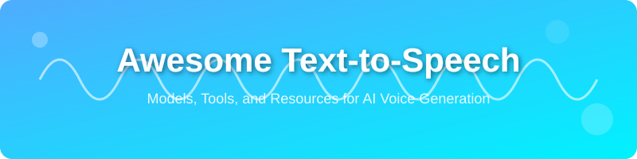

  

# Awesome Text-to-Speech (TTS) 🗣️: Best AI Voice Generation Models & Tools 2026

---

### 🚀 The Ultimate Guide to AI Voice Generation, Speech Synthesis, and Neural Voice Cloning

Welcome to the most comprehensive, meticulously curated, and continuously updated list of **Text-to-Speech (TTS)** resources. Whether you are looking for the **best open-source TTS models of 2026**, searching for **low-latency TTS APIs for AI agents**, or exploring **high-fidelity voice cloning for content creation**, you've found the right place.

> [!TIP]
> **Looking for the best ElevenLabs alternatives?** This repository tracks the rapidly evolving landscape of both commercial SaaS and local-first neural speech synthesis.

---

## 🗺️ Quick Navigation

- [Why Text-to-Speech?](#-why-explore-text-to-speech)
- [Current Trends (2026)](#-current-state-of-text-to-speech-2026-update)
- [Commercial & Cloud Platforms](#-cloud-based--commercial-ai-voice-generation-platforms)
- [Open-Source Libraries](#-open-source-text-to-speech-libraries--projects)
- [Advanced Voice Cloning](#-advanced-voice-cloning--neural-voice-synthesis-)
- [Research & Community](#-notable-research-papers--community-discussions-)
- [FAQ & Use Cases](#-frequently-asked-questions--seo-insights)

---

## 🔊 Why Explore Text-to-Speech?

Text-to-Speech technology has moved beyond robotic voices. Today, it powers:
*   **Accessibility First:** High-quality screen readers for the visually impaired.
*   **Automated Content Creation:** Realistic voiceovers for YouTube, podcasts, and e-learning.
*   **Next-Gen AI Agents:** Real-time conversational AI with human-like prosody.
*   **Multilingual Support:** Instant translation and dubbing for global reach.
*   **Personalization:** Custom voice clones for gaming and virtual assistants.

---

## 📈 Current State of Text-to-Speech (2026 Update)

The landscape of **AI voice synthesis** has shifted from basic concatenation to advanced **Generative Speech Models**. Key highlights:

-   **Hyper-realistic and Natural Speech Synthesis:** Innovations in deep learning and neural network architectures have led to highly natural, expressive, and emotionally nuanced synthetic voices. 🎤
-   **Next-Generation Architectures:** The adoption of State Space Models (SSMs), Diffusion Models, and advanced transformer-based architectures is offering superior performance, efficiency, and voice quality in speech generation. 🧠
-   **Real-time Conversational AI:** Significant advancements in reducing latency now enable real-time TTS, making conversational AI, virtual assistants, and live dubbing more natural and responsive. ⚡
-   **Advanced Voice Cloning and Style Transfer:** Cutting-edge techniques allow for high-fidelity voice cloning from minimal audio samples and the transfer of speaking style and emotion across different voices. 🎭
-   **Multilingual and Cross-Lingual TTS:** Models are increasingly capable of generating speech in numerous languages with accurate pronunciation and intonation, breaking down language barriers.

## 📚 Comprehensive List of Text-to-Speech (TTS) Resources 🌐

### ☁️ Cloud-based & Commercial AI Voice Generation Platforms

Leading platforms offering robust, scalable, and high-quality Text-to-Speech APIs and services for various applications. *Sorted by Company Scale / Valuation (Descending).*

| 🛠️ Service/Model | 🏢 Organization | 🌟 Key Features | 💰 Min. Monthly Subscription | 👥 Company Size | 🔗 Link |
| --- | --- | --- | --- | --- | --- |
| **NVIDIA NeMo** | NVIDIA | Platform for building, training, and deploying generative AI models, including TTS and ASR. | **Free** (API Credits) / Enterprise | **$3.3T+** (Market Cap) | [NVIDIA NeMo](https://developer.nvidia.com/nemo) |
| **Azure AI Speech** | Microsoft | High-quality neural voices with advanced fine-tuning, emotion, and enterprise scalability. | **Free** (0.5M chars/mo) / PAYG | **$3.2T+** (Market Cap) | [Azure AI Speech](https://azure.microsoft.com/en-us/products/ai-services/ai-speech) |
| **Google Cloud TTS** | Google | Powerful TTS API with a large variety of natural-sounding voices and extensive customization. | **Free** (1M+ chars/mo) / PAYG | **$2.2T+** (Market Cap) | [Google Cloud TTS](https://cloud.google.com/text-to-speech) |
| **AWS Polly** | Amazon | Generative, Neural and Standard TTS voices with deep AWS ecosystem integration. | **Free** (1M+ chars/mo) / PAYG | **$1.9T+** (Market Cap) | [AWS Polly](https://aws.amazon.com/polly/) |
| **OpenAI TTS** | OpenAI | High-quality, real-time streaming TTS models for applications requiring natural AI voices. | Pay-as-you-go ($5 free credit) | **$852B** (Valuation) | [OpenAI TTS](https://platform.openai.com/docs/guides/text-to-speech) |
| **ElevenLabs** | ElevenLabs | State-of-the-art AI voice generator offering realistic voices, voice cloning, and AI dubbing. | **Free** (10k chars/mo) / $5 | **$11B** (Valuation) | [ElevenLabs](https://elevenlabs.io/) |
| **Speechify** | Speechify | Highly popular consumer text-to-speech and developer Voice API with natural and premium voices. | **Free** (Basic Voices) / $139/yr | **$1.5B** (Valuation) | [Speechify](https://speechify.com/) |
| **Deepgram Aura** | Deepgram | Specializing in low-latency TTS designed for real-time conversational AI and virtual interactions. | **Free** ($200 credit) / PAYG | **$1.2B** (Valuation) | [Deepgram Aura](https://deepgram.com/aura) |
| **Inworld AI** | Inworld AI | Character-driven conversational voice engine and real-time speech generation for interactive agents. | **Free** (Basic / 100k API credits) / $20 | **$500M** (Valuation) | [Inworld AI](https://inworld.ai/) |
| **Hume AI (EVI)** | Hume AI | Empathic Voice Interface with emotional prosody detection and low-latency expressive speech. | **Free** ($10 credit) / PAYG ($0.036/min) | **$250M** (Valuation) | [Hume AI](https://www.hume.ai/) |
| **Cartesia Sonic** | Cartesia | Sub-100ms ultra-low latency TTS designed for real-time AI agents. | **Free** (API Credits) / PAYG | **$200M** (Valuation) | [Cartesia](https://cartesia.ai/) |
| **Gradium** | Gradium | Real-time TTS and STT for voice agents. 158ms P50 time-to-first-audio, streaming and instant voice cloning. | **Free** (45k credits) / $13 | **$100M** (Seed Raised) | [Gradium](https://gradium.ai/) |
| **Murf.ai** | Murf.ai | AI voiceovers with a built-in video editor, ideal for creators and presentations. | **Free** (10 mins total) / $19 | **$46M** (Valuation) | [Murf.ai](https://murf.ai/) |
| **WellSaid Labs** | WellSaid Labs | Enterprise AI voice platform with natural studio voices, fine phonetic control, and brand voice avatars. | **Free** (7-day trial / 50 clips) / $49 | **$40M** (Valuation) | [WellSaid Labs](https://wellsaidlabs.com/) |
| **Resemble AI** | Resemble AI | High-fidelity voice cloning, neural watermarking, deepfake detection, and real-time speech synthesis. | **Free** (Free trial) / $29 | **$30M** (Valuation) | [Resemble AI](https://www.resemble.ai/) |
| **LMNT** | LMNT | Lightning-fast TTS API with exceptional naturalness, great for interactive voice apps. | **Free** (API Credits) / PAYG | **$21M** (Estimated) | [LMNT](https://www.lmnt.com/) |
| **Lovo.ai (Genny)** | LOVO | Next-gen AI voice generator with 500+ voices in 100+ languages and granular pitch/emphasis controls. | **Free** (14-day Pro trial) / $29 | **$20M** (Estimated) | [Lovo.ai](https://lovo.ai/) |
| **Play.ht** | Play.ht | Professional AI voices and "Ultra-Realistic" studio editor for long-form content. | **Free** (12.5k chars) / $39 | **$15M** (Valuation) | [Play.ht](https://play.ht/) |
| **Smallest.ai (Waves)** | Smallest.ai | Lightning-fast TTS API with sub-100ms latency designed for real-time conversational agents and voice bots. | **Free** (10k chars/mo) / PAYG ($0.08/1k chars) | **$12M** (Valuation) | [Smallest.ai](https://smallest.ai/) |
| **Rime Labs** | Rime | Ultra-fast expressive voice API built specifically for interactive conversational AI applications. | **Free** ($5 credit) / PAYG | **$10M** (Estimated) | [Rime](https://rime.ai/) |
| **Soniox TTS** | Soniox | Real-time streaming TTS API for conversational AI voice agents in 60+ languages with multilingual voices. | Pay-as-you-go (~$0.70/hr) | **$10M** (Estimated) | [Soniox](https://soniox.com/) |
| **Neets.ai** | Neets | Extremely fast and affordable TTS APIs starting at $0.0004 per 1k characters. | **Free** (API Credits) / PAYG | **$5M** (Estimated) | [Neets.ai](https://neets.ai/) |
| **Gandr** | Gandr | TTS API for voice agents. Word error rate 1.98 percent against a 2.17 percent human reference on the same scorer, one voice in 23 languages, every render watermarked. Python/JS SDKs, LiveKit plugin, MCP server. | From $10/mo. Flat-rate unmetered streams from $150/mo | **<$1M** (Indie) | [Gandr](https://gandr.ai/) |
| **Spokio** | Spokio | Offline macOS text-to-speech app with local voice cloning, batch export, and no cloud uploads. | **Free** (API Credits) / Enterprise | **<$1M** (Indie) | [Spokio](https://spokio.pro/) |
| **PHANTOM VOICES** | PHANTOM VOICES | 10 free professional AI voice clones via public REST API. Zero cost, commercial rights cleared. 29 platform configs (Vapi, Retell AI, etc). Multilingual (9+ languages). AI-powered recommendation. | **Free** (API Credits) / Enterprise | **<$1M** (Indie) | [PHANTOM VOICES](https://auto-business-agent.replit.app/portfolio) |
| **RunAPI ElevenLabs SDK** | RunAPI | Multi-language SDKs for ElevenLabs text-to-speech, dialogue generation, sound effects, transcription, and audio isolation workflows. | Pay-as-you-go | **<$1M** (Indie) | [RunAPI ElevenLabs SDK](https://github.com/runapi-ai/elevenlabs-sdk) |
| **Audexum** | Audexum | Text-to-speech and speech-to-text in one API: 43 voices, 32 TTS languages, 25 STT languages. ElevenLabs-compatible endpoint, so switching is a base-URL change. EU-hosted, every output watermarked. | **Free** (30k credits at signup, 3k/mo after) / EUR 4 | **<$1M** (Indie) | [Audexum](https://audexum.com/docs) |

### 🏗️ Open-Source Text-to-Speech Libraries & Local-First Projects

If you are looking for **free text-to-speech models for commercial use** or want to run **TTS locally on a CPU**, these open-source projects provide the best balance of quality and privacy. *Sorted by GitHub Star Counts (Descending).*

  

| 🛠️ Service/Model | 🏢 Organization | 🌟 Key Features | 🗣️ Primary Language | 📁 Github_Repository |
| --- | --- | --- | --- | --- |
| **🐸 Coqui TTS** | Coqui (community) | Supports 1100+ languages, zero-shot voice cloning, and fine-tuning. *Note: Coqui AI (the company) shut down in late 2023; actively maintained by the community at [idiap/coqui-ai-TTS](https://github.com/idiap/coqui-ai-TTS).* | Python / Multilingual |  |
| **GPT-SoVITS** | RVC-Boss | **Zero-shot & few-shot voice cloning.** Requires only 5 seconds of sample audio for cross-lingual synthesis. | Python / PyTorch |  |
| **Bark** | Suno | Transformer-based text-to-audio model capable of highly expressive speech, music, laughs, and sighs. | Python / PyTorch |  |
| **ChatTTS** | 2noise | Conversational text-to-speech model specially optimized for dialogue and natural conversational flow. | Python |  |
| **OpenVoice** | MyShell | Highly versatile and instant voice cloning that requires only a short audio clip. | Python |  |
| **Fish Speech** | Fish Audio | SOTA multilingual, multi-speaker model with superior naturalness. | Python |  |
| **Chatterbox** | Resemble AI | Advanced **neural voice synthesis** with emotion control and high-fidelity cloning. | Python |  |
| **CosyVoice** | Alibaba | Excellent multilingual and zero-shot voice cloning model capable of high fidelity. | Python |  |
| **KittenTTS** | KittenML | ONNX-based library for **low-latency TTS** without requiring a GPU. | Python / ONNX |  |
| **F5-TTS** | SWivid | **Flow Matching TTS.** Incredible naturalness and prosody using DiT architectures. | Python |  |
| **Tortoise-TTS** | James Betker | Powerful multi-voice TTS system known for its exceptional voice cloning capabilities. | Python |  |
| **VALL-E-X** | Plachtaa | Open-source implementation of Microsoft's VALL-E X for zero-shot cross-lingual voice cloning. | Python / PyTorch |  |
| **Piper** | Rhasspy | **Fastest local TTS.** Optimized for low-end hardware and offline use. | C++ / Python |  |
| **Amphion** | Amphion | Open-source audio, music and speech generation toolkit containing multiple SOTA TTS models. | Python |  |
| **VoiceCraft** | Jason Li et al. | Token-infilling neural codec model for zero-shot speech editing and TTS synthesis. | Python / PyTorch |  |
| **Kokoro-82M** | Hexgrad | **Best SOTA CPU TTS.** Ultra-fast, studio quality, only 82M parameters. | ONNX / Python |  |
| **StyleTTS 2** | yl4579 | **Human-level TTS.** Uses style diffusion, adversarial training, and large SLMs without phoneme duration models. | Python / PyTorch |  |
| **MeloTTS** | MyShell | Ultra-fast multilingual TTS running smoothly on CPU across English, Spanish, French, Chinese, Japanese, Korean. | Python / PyTorch |  |
| **sherpa-onnx** | Next-gen Kaldi | Offline multi-platform speech synthesis engine supporting VITS, Piper, and Kokoro on embedded/mobile/desktop. | C++ / Python / Go |  |
| **Parler-TTS** | Hugging Face | Lightweight, controllable speech generation with high naturalness. | Python | [HF](https://huggingface.co/parler-tts) |
| **GLM-4-Voice** | Zhipu AI | End-to-end voice model supporting real-time speech generation, emotion alteration, and bilingual dialogue. | Python / PyTorch |  |
| **Matcha-TTS** | Shivam Mehta | Fast TTS architecture employing conditional flow matching, producing highly natural output. | Python |  |
| **LocalMode** | LocalMode | **In-browser TTS.** Runs Kokoro (29 voices) and other AI models 100% in the browser via WebGPU/WASM. No server, no API keys, offline after first load. | JavaScript / TypeScript |  |
| **Vocello** | PowerBeef | **Native Mac & iPhone app.** Qwen3-TTS with preset speakers, natural-language voice design, and voice cloning. Runs entirely on Apple Silicon with no Python runtime, faster than realtime on an 8 GB M2. | Swift / MLX |  |

### Advanced Voice Cloning & Neural Voice Synthesis 🧬

Dedicated resources and examples focusing on the latest in voice replication and advanced synthetic voice generation.

-   **XTTS-v2 by Coqui:** A breakthrough in voice cloning, capable of replicating a voice from just a 6-second audio clip, preserving emotion and speaking style.
-   **GPT-SoVITS:** Powerful few-shot voice cloning requiring only 5 seconds of sample audio to fine-tune or zero-shot clone with cross-lingual support.
    *   [GPT-SoVITS on GitHub](https://github.com/RVC-Boss/GPT-SoVITS)
-   **CosyVoice 2 by Alibaba:** SOTA multi-lingual voice cloning and emotional style transfer with sub-second prompt audio and dialect support.
    *   [CosyVoice on GitHub](https://github.com/FunAudioLLM/CosyVoice)
-   **Resemble AI's Chatterbox:** Offers advanced zero-shot voice cloning capabilities, enabling instant voice replication without extensive training data.
-   **ElevenLabs Voice Cloning:** Provides robust tools for creating highly realistic voice clones, suitable for personalized audio content.
-   **StyleTTS 2:** State-of-the-art style diffusion TTS that matches human speech naturalness via continuous style vectors and adversarial training.
    *   [StyleTTS 2 on GitHub](https://github.com/yl4579/StyleTTS2)
-   **VoiceCraft:** State-of-the-art token-infilling neural codec model capable of both zero-shot voice cloning and precise in-audio speech editing.
    *   [VoiceCraft on GitHub](https://github.com/jasonppy/VoiceCraft)
-   **Suno Bark:** A transformer-based text-to-audio model that generates highly naturalistic, multilingual speech, music, and sound effects. It excels at expressive speech with nuances like laughter, sighs, and crying.
    *   [Bark on GitHub](https://github.com/suno-ai/bark)
-   **MeloTTS:** A multi-language, multi-speaker Text-to-Speech model capable of generating high-quality audio.
    *   [MeloTTS on GitHub](https://github.com/myshell-ai/MeloTTS)

### Hugging Face 🤗 - The Hub for TTS Models

[Hugging Face](https://huggingface.co/) has emerged as a central ecosystem for sharing, discovering, and experimenting with a vast array of pretrained Text-to-Speech models. Explore their extensive collection for diverse applications and research.

-   [Browse TTS Models on Hugging Face](https://huggingface.co/models?pipeline_tag=text-to-speech)

### Notable Research Papers & Community Discussions 📝

Stay updated with the latest breakthroughs and discussions in the TTS community.

-   [[N] Baidu AI Can Clone Your Voice in Seconds](https://www.reddit.com/r/MachineLearning/comments/7zb2jm/n_baidu_ai_can_clone_your_voice_in_seconds/) (Reddit discussion on voice cloning technology)
-   [[R] Expressive Speech Synthesis with Tacotron](https://www.reddit.com/r/MachineLearning/comments/87klvo/r_expressive_speech_synthesiss_with_tacotron/) (Reddit discussion on making TTS more human-like)
-   [[D] Realtime Neural Voice Style Transfer Feasibility and Implications](https://www.reddit.com/r/MachineLearning/comments/8opn4c/d_realtime_neural_voice_transfer/) (Discussion on the challenges and potential of real-time voice style transfer)
-   [[D] Is there an implementation of Neural Voice Cloning?](https://www.reddit.com/r/MachineLearning/comments/8o7mkt/d_is_there_an_implementation_of_neural_voice/) (Community quest for neural voice cloning implementations)
-   [[D] Are the hyper-realistic results of Tacotron-2 and Wavenet not reproducible?](https://www.reddit.com/r/MachineLearning/comments/845uji/d_are_the_hyperrealistic_results_of_tacotron2_and/) (Discussion on reproducibility in advanced TTS models)
-   [[P] Voice Style Transfer: Speaking like Kate Winslet](https://www.reddit.com/r/MachineLearning/comments/7a0wcv/p_voice_transfer_speaking_like_kate_winslet/) (Showcase of voice style transfer examples)
-   **[ChatTTS: A Generative Speech Model for Daily Dialogue](https://arxiv.org/abs/2406.03807):** Conversational TTS model optimized for conversational nuances, laughter, and natural interjections.
-   **[CosyVoice: A Multi-lingual Large Voice Generation Model](https://arxiv.org/abs/2407.05407):** In-context voice cloning with detailed multi-dialect representations.
-   **[F5-TTS: A Strong Baseline for Zero-Shot Text-to-Speech with Diffusion Transformer](https://arxiv.org/abs/2410.06885):** A highly influential paper on Flow Matching and DiT architectures for seamless voice cloning.
-   **[MaskGCT: Zero-Shot Text-to-Speech with Masked Generative Codec Transformer](https://arxiv.org/abs/2409.00750):** Non-autoregressive multi-stage masked modeling without text-to-phoneme alignment.
-   **[MambaVoiceCloning (MVC)](https://arxiv.org/abs/2510.04738):** Research on using State Space Models (SSMs) to achieve human-level speech synthesis with linear-time complexity.
-   **[NaturalSpeech 3: Zero-Shot Speech Synthesis with Factorized Codec and Diffusion Models](https://arxiv.org/abs/2403.03100):** Microsoft's discrete factorized neural speech codec for natural zero-shot generation.
-   **[VALL-E R: Robust and Efficient Zero-Shot TTS](https://arxiv.org/abs/2406.07855):** Advancements in monotonic alignment for more stable autoregressive speech generation.
-   **[VoiceCraft: Zero-Shot Speech Editing and Text-to-Speech in the Wild](https://arxiv.org/abs/2403.16973):** Neural codec language model with causal masked token infilling.
-   **[Reddit: The ElevenLabs Killer Quest (r/TTS)](https://www.reddit.com/r/TTS/):** Community-driven search for high-fidelity, local open-source alternatives to proprietary SaaS.
-   **[TTS Arena by Artificial Analysis](https://artificialanalysis.ai/models/speech):** The definitive community leaderboard for blind-testing the naturalness of modern TTS models.
-   **[[D] Why Flow Matching is replacing traditional Diffusion in TTS](https://www.reddit.com/r/MachineLearning/):** Technical deep-dive into the "straightening" of ODE paths for faster, higher-quality audio generation.
-   **[An Automated Failure-Mode QA Framework for Neural Text-to-Speech Systems](https://doi.org/10.5281/zenodo.20757553):** A production case study introducing automated failure-mode detection for TTS output, with [ttsproof](https://github.com/Mormolykos/ttsproof) as its open-source implementation.

### Exemplary Code Samples & Project Demos 💻

A collection of influential code repositories and product demonstrations showcasing various Text-to-Speech implementations and their output quality. *Sorted by Year of Launch (Descending).*

| Project/Samples | Pretrained Models | Code Link | Paper/Arxiv ID | Output Quality | Year of Launch | Description |
| --- | :---: | :---: | :---: | :---: | :---: | :---: |
| [Gradbot Demos](https://github.com/gradium-ai/gradbot/tree/main/demos) | -- | [Code](https://github.com/gradium-ai/gradbot) | [Codebase](https://github.com/gradium-ai/gradbot) | A | 2026 | Eight voice agent demos (banking, hotel booking, 3D game NPCs) built on Gradium's real-time TTS/STT APIs. |
| [Fish Speech v1.5](https://github.com/fishaudio/fish-speech) | -- | [Code](https://github.com/fishaudio/fish-speech) | [Codebase](https://github.com/fishaudio/fish-speech) | A+ | 2026 | SOTA multilingual, multi-speaker model with superior naturalness. |
| [GLM-4-Voice Samples](https://github.com/THUDM/GLM-4-Voice) | -- | [Code](https://github.com/THUDM/GLM-4-Voice) | [Codebase](https://github.com/THUDM/GLM-4-Voice) | A | 2025 | End-to-end voice model with expressive bilingual dialogue. |
| [Kokoro-82M Samples](https://github.com/hexgrad/kokoro) | -- | [Code](https://github.com/hexgrad/kokoro) | -- | A | 2025 | Ultra-efficient CPU-based model with studio-quality output. |
| [ChatTTS Samples](https://chattts.com/) | -- | [Code](https://github.com/2noise/ChatTTS) | [2406.03807](https://arxiv.org/abs/2406.03807) | A+ | 2024 | Conversational dialogue speech synthesis with prosodic laughs and pauses. |
| [CosyVoice Samples](https://fun-audio-llm.github.io/) | -- | [Code](https://github.com/FunAudioLLM/CosyVoice) | [2407.05407](https://arxiv.org/abs/2407.05407) | A+ | 2024 | Multilingual voice generation with emotional control and multi-dialect support. |
| [F5-TTS Samples](https://github.com/SWivid/F5-TTS) | -- | [Code](https://github.com/SWivid/F5-TTS) | [2410.06885](https://arxiv.org/abs/2410.06885) | A | 2024 | Diffusion-based zero-shot cloning with impressive prosody. |
| [GPT-SoVITS Samples](https://github.com/RVC-Boss/GPT-SoVITS) | -- | [Code](https://github.com/RVC-Boss/GPT-SoVITS) | [Codebase](https://github.com/RVC-Boss/GPT-SoVITS) | A+ | 2024 | Powerful few-shot voice cloning requiring only 5 seconds of sample audio. |
| [MaskGCT Samples](https://maskgct.github.io/) | -- | [Code](https://github.com/open-mmlab/Amphion) | [2409.00750](https://arxiv.org/abs/2409.00750) | A | 2024 | Non-autoregressive zero-shot TTS using masked generative codec transformers. |
| [MeloTTS Samples](https://github.com/myshell-ai/MeloTTS) | -- | [Code](https://github.com/myshell-ai/MeloTTS) | [Codebase](https://github.com/myshell-ai/MeloTTS) | B | 2024 | Multilingual, multi-speaker TTS model for high-quality audio generation. |
| [Parler-TTS Samples](https://github.com/huggingface/parler-tts) | -- | [Code](https://github.com/huggingface/parler-tts) | [2402.01912](https://arxiv.org/abs/2402.01912) | B | 2024 | Samples from a lightweight model producing natural-sounding speech. |
| [VoiceCraft Samples](https://jasonppy.github.io/VoiceCraft_web/) | -- | [Code](https://github.com/jasonppy/VoiceCraft) | [2403.16973](https://arxiv.org/abs/2403.16973) | A | 2024 | Zero-shot speech editing and neural synthesis with token infilling. |
| [Bark Samples (Suno.ai)](https://suno.ai/) | -- | [Code](https://github.com/suno-ai/bark) | -- | A | 2023 | Samples from Suno's expressive text-to-audio model, including non-speech sounds. |
| [StyleTTS 2 Samples](https://styletts2.github.io/) | -- | [Code](https://github.com/yl4579/StyleTTS2) | [2306.07691](https://arxiv.org/abs/2306.07691) | A | 2023 | Human-level TTS with style diffusion and adversarial training. |
| [VALL-E X Samples](https://plachtaa.github.io/) | -- | [Code](https://github.com/Plachtaa/VALL-E-X) | [2303.03926](https://arxiv.org/abs/2303.03926) | A | 2023 | Cross-lingual zero-shot speech synthesis and voice cloning. |
| [XTTS-v2 Samples](https://coqui.ai/xtts-v2-demo) | -- | [Code](https://github.com/idiap/coqui-ai-TTS) | [2309.02055](https://arxiv.org/abs/2309.02055) | A | 2023 | Demonstrations of Coqui's advanced voice cloning with emotion transfer. |
| [rayhane's Tacotron2 Samples](https://rayhane-mamah.github.io/Tacotron-2_audio_samples/) | -- | -- | -- | D | 2019 | Audio samples from an early Tacotron 2 implementation. |
| [Google Tacotron + Style Transfer Sample](https://google.github.io/tacotron/publications/end_to_end_prosody_transfer/) (Official) | -- | -- | [1803.09047](https://arxiv.org/abs/1803.09047) | A | 2018 | Official samples showcasing prosody and style transfer with Tacotron. |
| [Kyubyong's DC-TTS on Nick Dataset Samples](https://soundcloud.com/kyubyong-park/sets/dc_tts_nick_800k) | -- | -- | -- | D | 2018 | DC-TTS samples generated from the Nick dataset. |
| [Kyubyong's Expressive Tacotron Samples](https://soundcloud.com/kyubyong-park/sets/expressive_tacotron_420k) | -- | [Code](https://github.com/Kyubyong/expressive_tacotron) | [1803.09047](https://arxiv.org/abs/1803.09047) | D | 2018 | Samples demonstrating expressive speech synthesis with Tacotron. |
| [Kyubyong's Tacotron on LJ Dataset Samples](https://soundcloud.com/kyubyong-park/sets/tacotron_lj_200k) | [Download model](https://www.dropbox.com/s/8kxa3xh2vfna3s9/LJ_logdir.zip?dl=0) | -- | -- | D | 2018 | Audio generated from Tacotron trained on the LJSpeech dataset. |
| [Kyubyong's Tacotron on Nick Dataset Samples](https://soundcloud.com/kyubyong-park/sets/tacotron_nick_215k) | -- | -- | -- | D | 2018 | Tacotron samples from the Nick dataset. |
| [Kyubyong's Tacotron on Web Dataset Samples](https://soundcloud.com/kyubyong-park/sets/tacotron_web_183k) | [Download model](https://www.dropbox.com/s/g7m6xhd350ozkz7/WEB_logdir.zip?dl=0) | -- | -- | D | 2018 | Tacotron speech output from the Web dataset. |
| [mazzzystar's Tacotron-WaveRNN Samples](https://github.com/mazzzystar/Tacotron-WaveRNN#samples) | [Get Model](https://github.com/mazzzystar/Tacotron-WaveRNN#pretrained-model) | [Code](https://github.com/mazzzystar/Tacotron-WaveRNN) | -- | A | 2018 | Demonstrations from a Tacotron and WaveRNN hybrid model. |
| [NVIDIA's Tacotron2 + WaveGlow Samples](https://nv-adlr.github.io/WaveGlow) | [Download Model](https://drive.google.com/file/d/1c5ZTuT7J08wLUoVZ2KkUs_VdZuJ86ZqA/view?usp=sharing) | [Code](https://github.com/NVIDIA/tacotron2) | -- | A | 2018 | Combined high-quality speech synthesis from Tacotron 2 and WaveGlow. |
| [NVIDIA's WaveGlow Samples](https://nv-adlr.github.io/WaveGlow) | [Download Model](https://drive.google.com/file/d/1cjKPHbtAMh_4HTHmuIGNkbOkPBD9qwhj/view?usp=sharing) | [Code](https://github.com/NVIDIA/waveglow) | [1811.00002](https://arxiv.org/abs/1811.00002) | A | 2018 | High-fidelity audio generated by NVIDIA's WaveGlow vocoder. |
| [syang1993's Tacotron + Style Transfer Samples](https://syang1993.github.io/gst-tacotron/) | [Model ErnstTmp (232k iter)](https://www.dropbox.com/s/fl1vqfz6611s8zw/checkpoint234000.tar?dl=0) | -- | [1803.09047](https://arxiv.org/abs/1803.09047) and [1803.09017](https://arxiv.org/abs/1803.09017) | C | 2018 | Samples demonstrating Tacotron with global style tokens for voice style transfer. |
| [andabi's Deep Voice Conversion](https://soundcloud.com/andabi/sets/voice-style-transfer-to-kate-winslet-with-deep-neural-networks) | -- | -- | -- | D | 2017 | Demonstrations of deep voice conversion techniques. |
| [Baidu's Deep Voice Samples](https://audiodemos.github.io) (Official) | -- | -- | -- | D | 2017 | Official audio demonstrations from Baidu's Deep Voice project. |
| [Baidu's Deep Voice 3 Samples](http://research.baidu.com/Blog/index-view?id=91) (Official) | -- | -- | [1710.07654](https://arxiv.org/pdf/1710.07654.pdf) | B | 2017 | Official samples from Deep Voice 3, showcasing advanced speech synthesis. |
| [DeepMind Neural Discrete Representation Learning Samples](https://avdnoord.github.io/homepage/vqvae/) (Official) | -- | -- | [1711.00937](https://arxiv.org/abs/1711.00937) | B | 2017 | Samples demonstrating speech generated using VQ-VAE for neural discrete representation learning. |
| [dhgrs's Implementation of Neural Discrete Representation Learning Samples](https://nana-music.com/playlists/2276008/) | [Download Model](https://drive.google.com/file/d/1Ayy9NbpBoZCj1WVmwHGnUTG_jB2eonVU/view) | [Code](https://github.com/dhgrs/chainer-VQ-VAE) | [1711.00937](https://arxiv.org/abs/1711.00937) | D | 2017 | Audio generated using a Chainer implementation of VQ-VAE for speech. |
| [Facebook Loop Samples](https://ytaigman.github.io/loop/) (Official) | [Get model](https://github.com/facebookresearch/loop#pretrained-models) | -- | -- | D | 2017 | Official audio samples from Facebook's Loop project. |
| [Google Tacotron2 Samples](https://google.github.io/tacotron/publications/tacotron2/index.html) (Official) | -- | -- | [1712.05884](https://arxiv.org/abs/1712.05884) | A | 2017 | Official, high-quality audio samples from the groundbreaking Tacotron 2 model. |
| [keithito's Tacotron Samples](https://keithito.github.io/audio-samples/) | [Get model](https://github.com/keithito/tacotron#using-a-pre-trained-model) | -- | -- | D | 2017 | Audio samples from keithito's Tacotron implementation. |
| [Kyubyong's DC-TTS Kate Samples](https://soundcloud.com/kyubyong-park/sets/dc_tts_kate_800k) | -- | -- | -- | D | 2017 | DC-TTS samples featuring the "Kate" voice. |
| [Kyubyong's DC-TTS on LJ Dataset Samples](https://soundcloud.com/kyubyong-park/sets/dc_tts_lj_800k) | [Get model](https://github.com/Kyubyong/dc_tts#pretrained-model-for-lj) | -- | -- | D | 2017 | DC-TTS generated speech from the LJSpeech dataset. |
| [mazzzystar's RandomCNN Voice Transfer](https://soundcloud.com/mazzzystar/sets/speech-conversion-sample) | -- | -- | [1712.08363](https://arxiv.org/abs/1712.08363) | D | 2017 | Speech conversion samples using Random CNNs. |
| [r9y9's Wavenet Vocoder Tacotron2 Samples](https://r9y9.github.io/wavenet_vocoder/) | [Download Tacotron2 model](https://www.dropbox.com/s/vx7y4qqs732sqgg/pretrained.tar.gz?dl=0) - [Download Wavenet model](https://www.dropbox.com/s/zdbfprugbagfp2w/20180510_mixture_lj_checkpoint_step000320000_ema.pth?dl=0) - [Get models](https://github.com/r9y9/wavenet_vocoder#pre-trained-models) | -- | [1712.05884](https://arxiv.org/abs/1712.05884) and [1611.09482](https://arxiv.org/abs/1611.09482) | B | 2017 | Samples from a Tacotron 2 and WaveNet vocoder combination. |
| [Griffin-Lim Samples](https://nv-adlr.github.io/WaveGlow) | -- | -- | -- | A | 1984 | Classic samples from the Griffin-Lim algorithm for spectrogram inversion. |

## Work in Progress & Future of Text-to-Speech 🚧

Ongoing projects and cutting-edge research shaping the next generation of AI voice synthesis.

-   https://github.com/ErnstTmp is implementing https://arxiv.org/abs/1807.06736
-   https://github.com/nii-yamagishilab/self-attention-tacotron
-   https://github.com/nii-yamagishilab/tacotron2

If I missed your output sample/demo in this consolidation, just add and send a pull request. I will be more than happy to add it. Thanks!

## Codelabs & Interactive Tutorials 🧪

Practical guides and interactive notebooks for experimenting with Text-to-Speech models.

-   https://github.com/tugstugi/dl-colab-notebooks
-   [Brainiall TTS MCP server and OpenAPI examples](https://github.com/fasuizu-br/brainiall-tts-mcp) — hosted neural TTS integration with 54 voices across nine languages, including Brazilian Portuguese.
-   [F5-TTS Interactive Gradio WebUI](https://github.com/SWivid/F5-TTS) — Multi-speaker zero-shot voice cloning playground.
-   [GPT-SoVITS WebUI & Colab Notebook](https://github.com/RVC-Boss/GPT-SoVITS) — One-click training and web interface for zero-shot and few-shot voice cloning.
-   [Kokoro-TTS Hugging Face Space](https://huggingface.co/spaces/hexgrad/Kokoro-TTS) — Live interactive playground for testing Kokoro-82M studio voices.

## Product Demos & Showcase Videos 🎥

Visual demonstrations of advanced Text-to-Speech and voice cloning in action.

-   [Lyrebird samples](https://lyrebird.ai/g/vWI8bJTl)(official)
-   [Lyrebird Demo](https://youtu.be/YfU_sWHT8mo)(official)
-   [Google Duplex Demo](https://www.youtube.com/watch?v=D5VN56jQMWM&t=66s)(official)
-   [Adobe Voco Demo](https://youtu.be/I3l4XLZ59iw)(official)
-   [Voice Cloning Toolbox](https://www.youtube.com/watch?v=-O_hYhToKoA)(official)
-   [OpenAI GPT-4o Advanced Voice Mode Demo](https://youtu.be/DQacCB9tDaw) (Native multimodal S2S interaction)
-   [Google Gemini Live Showcase](https://youtu.be/D5VN56jQMWM) (Real-time conversational AI with barge-in)
-   [ElevenLabs v3: Cinematic Audio Tags](https://elevenlabs.io/blog/v3-announcement) (Directing emotion with [whispers] and [laughs])
-   [Cartesia Sonic: Sub-100ms Latency Demo](https://cartesia.ai/sonic-demo) (Real-time AI agent performance)
-   [Hume AI: Empathic Voice Interface](https://youtu.be/I3l4XLZ59iw) (AI that responds to human emotion)
-   [Kyutai Moshi Demo](https://moshi.chat/) (First open-source full-duplex conversational model)

## Related Works & Foundational Research 📚

Broader projects and research efforts that contribute to the Text-to-Speech ecosystem.

-   https://github.com/tensorflow/magenta

## Arxiv Sanity Preserver - Key Papers in Speech Synthesis 📄

Explore influential academic papers and preprints in the field of Text-to-Speech and voice AI.

-   http://www.arxiv-sanity.com/1705.08947v1
-   http://arxiv-sanity.com/1703.10135v2
-   [CosyVoice: A Multi-lingual Large Voice Generation Model](https://arxiv.org/abs/2407.05407) (Scalable multi-lingual speech generation model with in-context voice cloning)
-   [Flow Matching for Generative Modeling](https://arxiv.org/abs/2210.02747) (The foundation for modern F5-TTS and VoiceFlow)
-   [Mamba: Linear-Time Sequence Modeling with Selective State Spaces](https://arxiv.org/abs/2312.00752) (Enabling ultra-low latency TTS)
-   [MaskGCT: Zero-Shot Text-to-Speech with Masked Generative Codec Transformer](https://arxiv.org/abs/2409.00750) (SOTA non-autoregressive speech generation with 100K+ hours training)
-   [NaturalSpeech 3: Zero-Shot Speech Synthesis with Factorized Codec and Diffusion Models](https://arxiv.org/abs/2403.03100) (Microsoft's factorized diffusion model for human-level zero-shot synthesis)
-   [Scalable Diffusion Transformers with Spatiotemporal Masking](https://arxiv.org/abs/2212.09748) (The DiT core used in high-fidelity audio generation)
-   [StyleTTS 2: Towards Human-Level TTS with Style Diffusion](https://arxiv.org/abs/2306.07691) (The architecture behind Kokoro-TTS)

##  Star History

<a href="https://www.star-history.com/?repos=ishandutta2007%2FAwesome-Text-to-Speech&type=date&legend=bottom-right">
<picture>
<source media="(prefers-color-scheme: dark)" srcset="https://api.star-history.com/chart?repos=ishandutta2007/Awesome-Text-to-Speech&type=date&theme=dark&legend=bottom-right" />
<source media="(prefers-color-scheme: light)" srcset="https://api.star-history.com/chart?repos=ishandutta2007/Awesome-Text-to-Speech&type=date&legend=bottom-right" />

</picture>
</a>

## 💬 Community & Support for Text-to-Speech Enthusiasts

Connect with the community, get support, and stay informed about the latest in TTS.

-   **📚 [Documentation](https://docs.open-workflows.com):** Check out our official documentation for detailed guides and tutorials on utilizing TTS technologies.
-   **🗣️ [Forum](https://community.open-workflows.com):** Join our community forum to ask questions, share your Text-to-Speech projects, and connect with other users and developers.
-   **💬 [Discord](https://discord.com/invite/jc4xtF58Ve):** Chat with us on Discord for real-time support and discussions on AI voice generation.
-   **🐦 [Twitter](https://twitter.com/ishandutta2007):** Follow us on Twitter for the latest news, updates, and insights into the world of synthetic speech.
-   **🐦 [Github](https://github.com/ishandutta2007):** Follow me on Github for the latest commits and updates on this and other AI projects.

## 🎯 Key Use Cases for AI Voice Generation

Explore how **Text-to-Speech** and **Voice Cloning** are being used across industries:

*   **🎙️ Podcast Automation:** Convert written articles into high-quality audio episodes instantly.
*   **🎮 Video Game Development:** Dynamic NPC dialogue using local-first TTS like **Piper** or **Kokoro**.
*   **🛠️ Customer Support:** Low-latency conversational AI for 24/7 automated support.
*   **📖 Accessible E-Learning:** Making educational content accessible with natural-sounding voices.
*   **🎬 Content Localization:** Dubbing videos into multiple languages while preserving the original speaker's emotion.

---

## ❓ Frequently Asked Questions (FAQ) & SEO Insights

### What is the best open-source Text-to-Speech model in 2026?
As of 2026, **Kokoro-82M** is widely considered the best for CPU-based local inference due to its studio quality and small footprint. For high-fidelity and expressive speech, **F5-TTS** and **Fish Speech** are leading the way in naturalness.

### Are there free ElevenLabs alternatives for voice cloning?
Yes! Projects like **Coqui XTTS-v2**, **GPT-SoVITS**, and **OpenVoice** offer high-quality voice cloning for free. If you are looking for local-first alternatives, check out **F5-TTS** and **CosyVoice**.

### How do I achieve low-latency TTS for AI agents?
To achieve sub-200ms latency, it is recommended to use **Deepgram Aura**, **Cartesia Sonic**, **Smallest.ai**, or optimized local models like **Piper** (C++ implementation) and **Kokoro-82M** with ONNX runtime.

### Can I use these TTS models for commercial projects?
Many models listed here (like **OpenAI TTS**, **ElevenLabs**, and **Azure AI Speech**) have clear commercial tiers. For open-source models, look for those with **MIT** or **Apache 2.0** licenses, such as **Piper** and **Kokoro**.

---

## 💖 Support & Sponsorship

If you find this collection of Text-to-Speech resources helpful, or if it has saved you time and effort in your AI voice generation endeavors, please consider sponsoring the development. Your support helps maintain the project, add new cutting-edge models and tools, and keep this initiative open-source and accessible to everyone.

**[Sponsor @ishandutta2007 on GitHub](https://github.com/sponsors/ishandutta2007)**

-   [PAYPAL](https://paypal.me/ishandutta2007)
-   [BITCOIN ADDRESS: 3LZazKXG18Hxa3LLNAeKYZNtLzCxpv1LyD](https://www.coinbase.com/join/5a8e4a045b02c403bc3a9c0c)

Every contribution, no matter how small, makes a huge difference in advancing the Text-to-Speech landscape! 🙏

## 📄 License

This project is licensed under the MIT License - see the [LICENSE](LICENSE) file for details.
